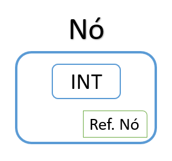
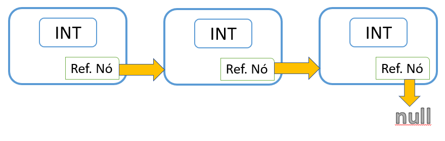
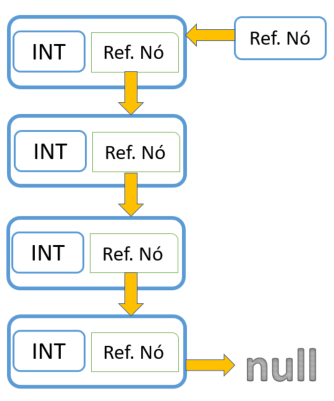
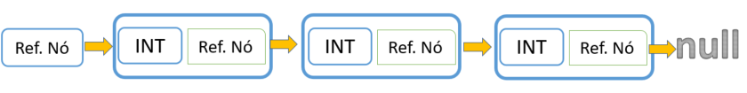

# Estrutura de dados em Java  :coffee:

### Descrição  

Repositório feito durante um curso de revisão de Estrutura de Dados com a linguagem Java.  
O intuito é compartilhar conteúdo e ao mesmo tempo deixar resgistrado todo o assunto abordado durante o curso. A fim de deixar de fácil acesso à todos que queiram visualizar e contribuir.

### Tipo Abstrato de Dados (TAD)  

Conjunto de valores e uma sequência de operações sobre estes valores, ou seja, um TAD encapsula ou agrupa um conjunto de dados associado a um elemento de computação junto aos operadores, que atuam na modificação desses dados.

### Conceito  

> *"Uma estrutura de dados (ED), em ciência da computação, é uma coleção tanto de valores (e seus  relacionamentos) quanto de operações (sobre os valores e estruturas decorrentes). É uma implementação concreta de um tipo abstrato de dado (TAD) ou um tipo de dado (TD) básico ou primitivo."*

### Atribuição e Referência em Java  

As atribuições em Java são sempre por cópia de valor.  

**Com Tipo Primitivo**: se é copiado o valor em memória.  
Ex.: Se `int a = 5;` e `int b = a;` então `a = 5 && b = 5`  

**Com Objetos**: se é copiado o valor da referência em memória, sem duplicar o objeto.  
Ex.: Se `NumObj num1 = new NumObj();` e `NumObj num2 = num1;` então ambos os objetos apontarão para o mesmo endereço de memória `NumObj@4617c264 - NumObj@4617c264`.  

**Obs.:** Se faz necessário usar do método `toString()` para printar os valores dos atributos do objeto que queremos, ao invés dos seus endereços de memória.  

### Conceito de Nó  

É um espaço em memória que armazena tanto o dado que queremos quanto uma referência para um próximo nó.  

  

#### Lista ligada (Linked List)  

Podemos dizer que é uma coleção de nós que juntos representam uma sequência. Nessa estrutura, um nó sempre irá apontar para o próximo, baseado em sua referência, e quando não houver próximo nó, será apontado para null (uma referência nula).

  

#### Pilha (Stack)  

É um tipo de estrutura de dados linear que segue um esquema particular de ordenação chamado *last in, first out (LIFO)*. Dessa forma, nós inserimos e removemos elementos do topo da pilha. Se quisermos ter acesso a um elemento no meio, devemos remover os elementos que estão em cima dele.  
Exs.:  
- Funções recursivas em compiladores;  
- Mecanismo de desfazer/refazer dos editores de texto;  
- Navegação entre páginas Web;  

  

**As principais operações são:**  

|    Operação    |                           Descrição                          |
|:--------------:|:------------------------------------------------------------:|
| push(elemento) |             adiciona um elemento no topo da pilha            |
|      pop()     |              remove um elemento do topo da pilha             |
|     peek()     | retorna uma cópia do elemento do topo da pilha sem removê-lo |
|    isEmpty()   |                  checa se a pilha está vazia                 |  

#### Fila (Queue)  

É um tipo de estrutura de dados linear que segue um esquema particular de ordenação chamado *first in, first out (FIFO)*. Diferentemente da **Pilha**, aqui o primeiro elemento a ser inserido, será o primeiro a ser retirado. Então adicionamos itens no fim da fila e removemos do início.  
Exs.:  
- Controle de documentos para impressão;  
- Troca de mensagem entre computadores numa rede;  

   

**As principais operações são:**  

|      Operação     |               Descrição              |
|:-----------------:|:------------------------------------:|
| enqueue(elemento) |  adiciona um elemento no fim da fila |
|     dequeue()     | remove um elemento do início da fila |
|     isEmpty()     |      checa se a fila está vazia      |